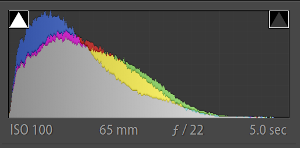

<!-- wp:paragraph -->

<strong>@Goal: Observe the environment impact on the photography taken with polarization.</strong>

<!-- /wp:paragraph -->

<!-- wp:paragraph -->

@fns x_shading_polarized_radiance_observation__190904

<!-- /wp:paragraph -->

<!-- wp:image {"id":241,"width":342,"height":512} -->
<figure class="wp-block-image is-resized"></figure>
<!-- /wp:image -->

# Curve of the non-polarized image.
